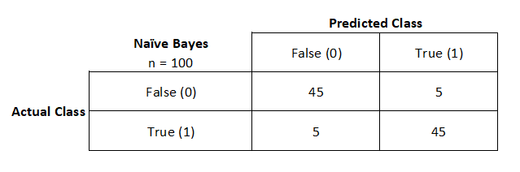
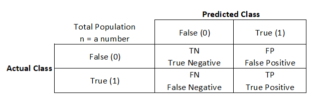
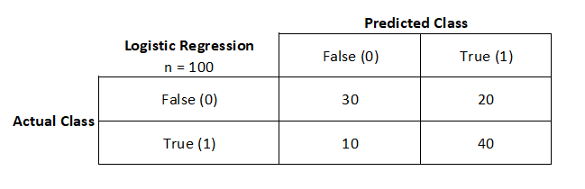
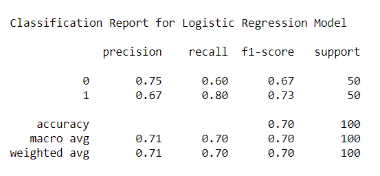
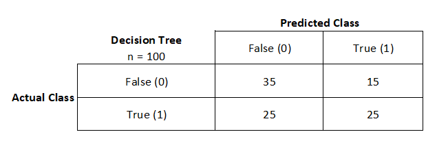
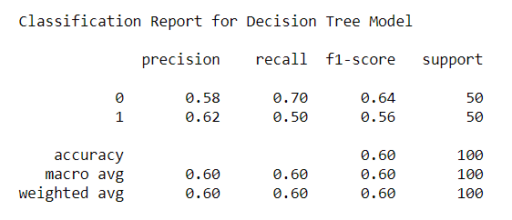

# Classification Report: Precision, Recall, F1-Score, Accuracy

This a continuation from [Confused About The Confusion Matrix?](https://medium.com/@kennymiyasato/confused-about-the-confusion-matrix-b98a1afb00af). Please read this one first before reading this one as I will be using the examples from that blog post.

## Original Example: Classification models have been trained to predict whether a person likes dogs (True) or not (False) based on different variables.

In the previous blog post I ended up using the hypothetical Naive Bayes model.



## If the confusion matrix does not look this perfect what do we do? 

In this case, we will be looking at the how to calculate scikit-learn's [classification report](https://scikit-learn.org/stable/modules/generated/sklearn.metrics.classification_report.html).

Let's take a look at the confusion matrix table example from the previous post and explain what the terms mean.



(TN) True Negative: The actual value was False, and the model predicted False.
> It correctly identified that the person does not like dogs.

(FP) False Positive: The actual value was False, and the model predicted True. This is also known as a [Type I error](https://en.wikipedia.org/wiki/Type_I_and_type_II_errors)
> It predicted yes, the person likes dogs, but they actually don't.

(FN) False Negative: The actual value was True, and the model predicted False. This is also known as a [Type II error](https://en.wikipedia.org/wiki/Type_I_and_type_II_errors)
> It predicted no, the person does not like dogs, but they actually do.

(TP) True Positive: The actual value was True, and the model predicted True.
> It correctly identified that the person does like dogs.

## What is the actual question we are trying to answer? 

Do we want to have less False Positives, less False Negatives, or an overall accuracy? No model will correctly identify, with 100% certainty, true negative and true positive values, there is always a trade off.

Let's pretend that we are trying to help a rescue shelter for cats and dogs. The rescue shelter has a questionnaire for people that do not know whether they want a cat or a dog. Based on the questionnaire the assigned agent will be able to determine whether the person will like cats or dogs more. **The shelter wants less people returning their original adopted pet.**

## Precision, Recall, F1-Score, Accuracy


When it predicts yes the person likes dogs, how often is it actually correct?


When it is actually yes the person likes dogs, how often does it predict correctly?


Weighted average between precision and recall. Useful when dealing with unbalanced samples.


The sum of true positives and true negatives divided by the total number of samples. This is only accurate if the model is balanced. It will give inaccurate results if there is a class imbalance.

## Let's compare that to the Logistic Regression confusion matrix example



```
(TN) True Negatives  = 30
(FP) False Positives = 20
(FN) False Negatives = 10
(TP) True Positives  = 40
```
```
Precision: 40 / 40 + 20                  = 0.67 or 67%
Recall:    40 / 40 + 10                  = 0.80 or 80%
F1-Score:  2 * (0.67 * 0.8)/(0.67 + 0.8) = 0.73 or 73%
Accuracy:  30 + 40 / 100                 = 0.70 or 70%
```



## Let's compare that to the Decision Tree confusion matrix example



```
(TN) True Negatives  = 35
(FP) False Positives = 15
(FN) False Negatives = 25
(TP) True Positives  = 25
```
```
Precision: 25 / 25 + 15                  = 0.62 or 62%
Recall:    25 / 25 + 25                  = 0.50 or 50%
F1-Score:  2 * (0.62 * 0.5)/(0.62 + 0.5) = 0.56 or 56%
Accuracy:  30 + 25 / 100                 = 0.60 or 60%
```



## Best model
Based on the perfomance metrics above, I will choose overall accuracy. Since our data is balanced, meaning a split between 50/50 true and negative samples, I can choose **accuracy**. The best model that gives me the best **accuracy** is the Logistic Regression model.

## Useful Links / Resources:
- [Classification Report](https://scikit-learn.org/stable/modules/generated/sklearn.metrics.classification_report.html)
- [Type I and II errors](https://en.wikipedia.org/wiki/Type_I_and_type_II_errors)
- [Precision and Recal](https://en.wikipedia.org/wiki/Precision_and_recall)
- [F1 Score](https://en.wikipedia.org/wiki/F1_score)
- [Model Selection: Accuracy, Precision, Recall or F1?](https://koopingshung.com/blog/machine-learning-model-selection-accuracy-precision-recall-f1/)
- [What’s the deal with Accuracy, Precision, Recall and F1?](https://towardsdatascience.com/whats-the-deal-with-accuracy-precision-recall-and-f1-f5d8b4db1021)
- [Simple guide to confusion matrix terminology](https://www.dataschool.io/simple-guide-to-confusion-matrix-terminology/)